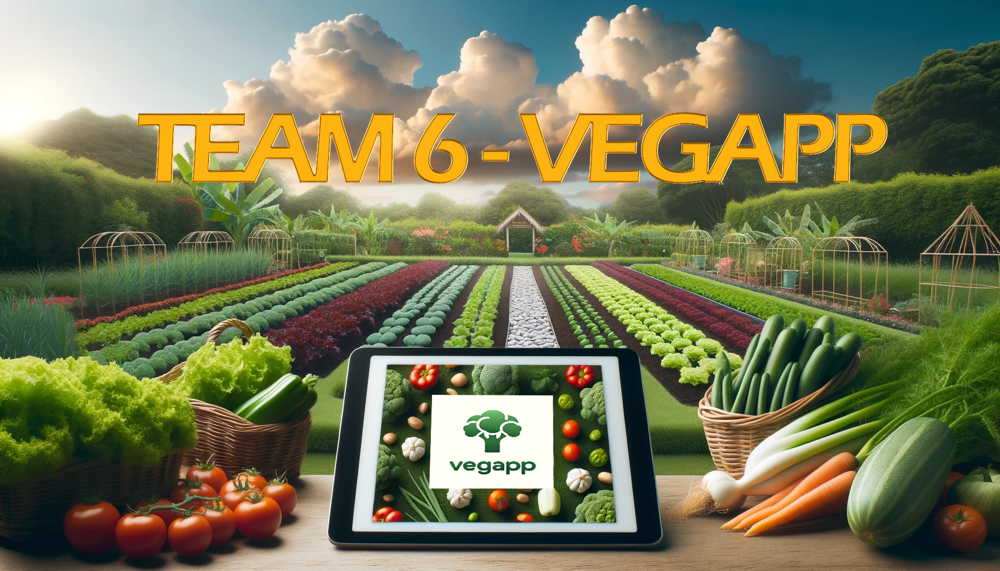
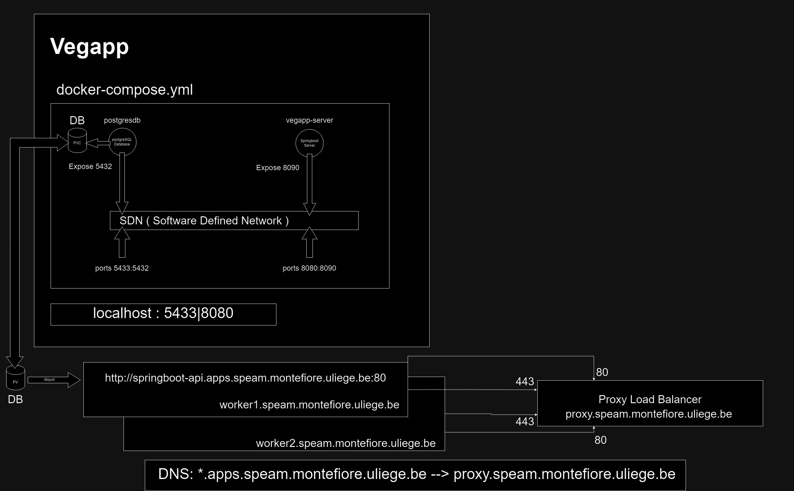
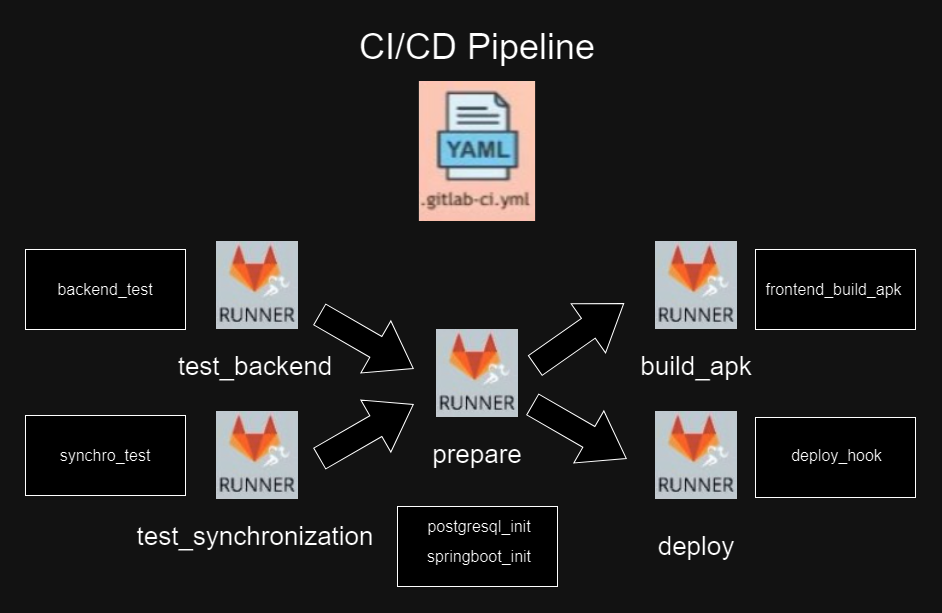

# VeGApp : My Autonomous Vegetable Garden App



VeGApp encapsulates the full potential of technology to transform traditional gardening into a modern, organized, and rewarding experience. From the heart of your garden to the comfort of your home, VeGApp is your ultimate gardening companion.

# Table of Contents
1. [Members](#1-members)
2. [Vegapp's Network Configuration](#2-vegapps-network-configuration)
3. [Gitlab Pipeline Set Up](#3-gitlab-pipeline-set-up)
4. ['oc' Commands to connect to postgreSQL database](#4-oc-commands-to-connect-to-postgresql-database)
5. [Directory Overview](#5-directory-overview)
6. [Notes About Local Deployment](#6-notes-about-local-deployment)
7. [Testing](#7-testing)
8. [Code Architecture Frontend](#8-code-architecture-frontend)
9. [Code Architecture Backend](#9-code-architecture-backend)
10. [Code Architecture Website](#10-code-architecture-website)
11. [Project Status](#11-project-status)
12. [License](#12-license)

## 1. Members

| Name              | Master                |
|-------------------|-----------------------|
| Alexandre Bruno   | Computer Science focus on Computer Security |
| Arnaud Crucifix   | Computer Science focus on Computer Security |
| Louis Hogge       | Computer Science & Engineering focus on Management |
| Simon Louveau     | Computer Science & Engineering focus on Computer Security |
| Julie Ngamia Djabiri | Computer Science & Engineering focus on Computer Security |
| Gregory Voskertchian | Computer Science & Engineering focus on Computer Security |

## 2. Vegapp's Network Configuration



## 3. Gitlab Pipeline Set Up



During the prepare stage, gitlab runners with the right permissions (tags) use docker-in-docker to log in the host registry, to build images for the postgreSQL database and the springboot server.
Building the images is triggered by changes on respective paths.
The test stage is divided in two, one regarding the backend and one regarding the synchronzation and the deploy stage involves deploying manually for now.

Variables that are set manually, stored in gitlab secret store and passed as environment variables inside the pipeline for security reason are :
```bash
# User/Pwd used to login, build, push to gitlab image registry
PUSH_USER: $CI_DEPLOY_TOKEN_USER
PUSH_TOKEN: $CI_DEPLOY_TOKEN_PASS
# PosgreSQL database password set as an environment inside the pipeline 
# So that images built using docker-in-docker inherit the variable so that the server can connect to the database.
POSTGRESS_PASSWORD_CICD: $POSTGRESS_PASSWORD_CICD
```

## 4. 'oc' Commands to connect to postgreSQL database
Follow the [oc](https://jira.montefiore.ulg.ac.be/xwiki/wiki/team0623/view/Operations/Tutorials/OpenShiftKubernetes/Using%20the%20%27oc%27%20Command%20Line/) command line tool installation.

Go to [Openshift GUI](https://console-openshift-console.apps.speam.montefiore.uliege.be/topology/ns/vegapp?view=graph) related to the project vegapp -> help -> Command line tools -> Copy login command

```bash
oc login --token=<your token> --server=<server's URL>
oc get pods
oc port-forward pod/<pod_name> <hostport>:<containerport>
oc port-forward pod/postgresdb-749fd78565-rgqmk <hostport>:5432
```

Recall that the container port is defined as 5432 in vegapp's network configuration.

## 5. Directory Overview

- [ ] $images$ : Used to store images relevant to this project.
- [ ] $kompose$-$local$-$adjusted$ : Deployment files adjusted after the execution of "kompose convert" command to match the network configuration.
- [ ] $kompose$-$local$-$raw$ : Raw outputs of the "kompose convert" command.
- [ ] $postgresdb$ : Dockerfile and initializing script for the postgreSQL database
- [ ] $vegapp$-$server$ : Springboot server defined here.
- [ ] $vegapp$-$server$/$src$/$main$/$java$/$com$/$vegAppTest$ : Springboot Server files
- [ ] vegapp-server/src/main/resources/static : Springboot Server webpage
- [ ] $.gitlab$-$ci.yml$ : Pipeline configuration file
- [ ] $docker$-$compose$-$local.yml$ : docker compose file.

## 6. Notes About Local Deployment
- [ ] docker-compose-local.yml
This file can be renamed to docker-compose.yml locally.
Execution of these commands will build the images of the PostgreSQL database and Springboot server locally.
Clone repository, have docker installed (Docker Desktop is super convenient to use too) and open a terminal in /vegapp/team-6
```bash
docker compose up
docker compose down -v
```
    
- [ ] docker compose up => start containers base on the docker-compose.yml file
- [ ] docker compose down -v => stop containers (-v option removes volumes so that it is not persistent locally anymore)
- [ ] docker desktop allows to see the image built from the docker-compose.yml file and the containers running
- [ ] springboot server hosting website on port 8090 of the container mapped to port 8080 of the host machine
- [ ] postgre database running on port 5432 of the container mapped to port 5433 of the host machine

## 7. Testing
The goal of this Software Project Engineering and Management is to specify, Develop and Test. The latest is of main interest during this analysis. \
The process model for our software development must integrates both model-driven approaches and Agile/Scrum methodologies. The project's alchemy can be defined as the blending of structured, model-driven planning with the flexibility of Agile/Scrum to create our product that meets the identified need and solves the initial problem.
- $7.1.$ $Problem/Need Identification$
    * The VeGApp mobile application and a web interface for managing one's garden.
- $7.2.$ $Refinement of Models$
    -> Model-Driven approach : the design and development are guided by models
    * Requirements : What the software should do
    * Use cases : Scenarios of how the software will be used
    * Domain objects : The significant entities and their relationships whithin the problem domain
    * Components : The modular parts of the software that will be built
- $7.3.$ $Product Breakdown/Product Backlog$
    * Insights from models are used to create a list of features, improvements, and bug fixes which is known as the product backlog in Agile/Scrum. This involves breaking down the product into smaller, manageable pieces that can be prioritized and scheduled for development in various sprints (Scrum approach).
- $7.4.$ $Refinement of Product$
    * The items in the product backlog are refined into a final application, keeping the model-driven approach consistent throughout the development. This is where the application is actually built, tested, and prepared for release.
- $7.5.$ $Agile/Scrum$
    * Iterative development, regular reviews, adaptation to changing requiremens, frequent communication among stakeholders is imperative.

**Thus, testing must be interprated as an attitude towards our software development throughout the year.** \
This implies that our models which must be improved after Scrum meetings, sprint reviews and technical problems encountered, are part of the **Testing** attitude just described. Furthermore, problems faced in order to create the application as a whole (mobile and web applications) while reconciling the needs of our client is also part of the **Testing** attitude. \
On one hand, the improvement of our model, of our understanding and usage of technologies finds itself defined in how Scrum meetings, client meetings and Sprint reviews were done, thus making this testing relevant for this part. \
On the other hand, a more concrete, more precise analysis of the technologies is presented in the context of the final product and the technological means implemented to achieve the latter. This implies that testing can be done regarding how we choose to conceptualize, to build and to execute our mobile and web applications. \
The mobile application was built using Flutter as for the frontend. The backend consists of a local database also in flutter for offline features and online features using a Springboot server and a PostgreSQL database deployed in Openshift. All in the context of continuous development/continuous integration with the help of the Gitlab environment and Openshift features. In addition, the Springboot server takes care of the web application and implements the web interface. \
- $7.6.$ $Testing$ $the$ $Frontend$
    * This is achieved by using the Gitlab pipeline to ensures that before building the apk of our application.
    * Website's tests can direclty be implemented inside the server.
- $7.7.$ $Testing$ $the$ $Backend$
    * This is more complex as it concerns multiple aspects of our software development. The API can be tested regarding the offline database and the online database to ensure for example that a connection cut doesn't break the application and that requests are indeed performed as they should and retrieve what is expected. This is done through a python script that simulates requests.
    * Another test we are working on will be to ensure that the protocol we used as a synchronization mechanism with a connection lost doesn't break the application or get to a case of failure. Synchronization is tested in particular cases using the framework defined in the test directory of the project.

## 8. Code Architecture Frontend

The architecture of the frontend code can be found in the `/frontend/lib/` directory, it follows a Model-View-Controller (MVC) pattern where each application component is separately categorized as a model, view or controller :
- Models are responsible for managing the application’s data, logic and rules. They represent the
application’s dynamic data structure, independent of the user interface.
- Views, on the other hand, are the visual representation of models, presenting data in a specific format dictated by the controller. The separation between view and model means that the user
interface can be modified without altering the underlying business logic.
- Controllers act as the interface between the Model and View components, handling all business logic and incoming requests, manipulating data using the Model component and interacting with
Views to obtain the final result.

In our project, Model is made up of classes that implement our app’s objects: `calendar_model.dart`, `category_model.dart`, `garden_model.dart`, `plant_model.dart`, `plot_model.dart`, `synchronize_model.dart` and `vegetable_model.dart`. It also contains classes that manage the application's logic: `selected_garden_model.dart` and `synchronizing_model.dart`.

Then, View is used to display all the screens of our application: `calendar_view.dart`, `categories_view.dart`,`gardens_view.dart`, `home_view.dart`, `new_garden_view.dart`, `new_user_view.dart`, `notes_view.dart`, `plot_creation_view.dart`, `plot_display_view.dart`, `plots_view.dart`, `primary_category_view.dart`, `secondary_category_creation_view.dart`, `secondary_category_view.dart`, `seed_view.dart`, `start_view.dart`, `vegetable_creation_view.dart` and `vegetable_display_view.dart`. Custom app bar and bottom bar has also been implemented: `custom_app_bar.dart` and `custom_bottom_bar.dart`.

Finally, Controller is filled with classes that manage user input and requests on every screen of the application: `calendar_controller.dart`, `category_controller.dart`, `garden_controller.dart`, `plot_controller.dart` and `vegetable_controller.dart`. Other classes are present to manage certain particularities of the app: `database_helper.dart` for the phone database, `qr_code_scanner.dart` for qr codes, `init_controller.dart` for initializing the new user/garden application, `synchronize_controller.dart` for synchronizing the application with the online database and `token.dart` for securely storing the user's identification token. Navigation within the app is managed by `routes.dart`.

## 9. Code Architecture Backend

- Server overview : The backend server uses SpringBoot, which is a Java-based framework designed to make the development of web applications and microservices with Spring Framework faster and easier.

- Database overview :  For the database, a postgreSQL database is used to store the data.

- Server components : The server is mostly divided into Controllers, Entities and Repositories. The controllers contain the HTTP endpoints. The entities describe the database tables. Finally, the repositories allow data access and manipulation in the database.

- Build tool : To build the server, Maven , which is an open-source build automation, is used. More specifically, Maven Wrapper is used, which allows to build and run the server in local without having to install Maven. It also ensures that everyone works with the same Maven version. To run the vegapp-server, this command can be used : ./mvnw spring-boot:run (it has to be launched inside the vegapp-server directory). The file pom.xml contains the Maven configuration files and all the dependencies used for the server. 

- Mapping between Java objects and database tables : Hibernate is a framework used to map Java objects to database tables. It is used in the server through annotations like @Entity or @Table in the entities. Thanks to Hibernate, there is for example no need to manually create tables in the database, it creates them thanks to the @Table annotation that is found in many entities.


- The token management in done within the files in the security folder. The server checks the validity of the token before allowing the request 
to be handled by the endpoints. The Https connection is handled with a self signed certificate.

## 10. Code Architecture Website

The website structure is as follows:

- **index.html**: HTML file that directs users to `/website/login.html`.

### Website Pages

- **/website/**
  - **login.html**: Web page where users can log in to their VeGApp account.
  - **signup.html**: Web page where users can create a new VeGApp account.
  - **signup_result.html**: Web page confirming that the account has been successfully created.
  - **menu.html**: Web page displaying the main menu of the VeGApp website, where users can select a garden.
  - **app_authenticate.html**: Web page to get the QR code for authentication via the mobile app.
  - **accountsettings.html**: Web page to view account information and delete the account.
  - **garden_homepage.html**: Web page to access the homepage of a garden.
  - **garden_history.html**: Web page to view the history of a given garden.
  - **garden_permissions.html**: Web page to manage user permissions for a garden.
  - **garden_addusers.html**: Web page to select the role for sharing the garden with a user.
  - **garden_addusers_result.html**: Web page displaying the QR code to share the garden with a user.
  - **garden_rename.html**: Web page to rename a garden.
  - **garden_delete.html**: Web page to delete a garden.

### Images

- **/images/**
  - **background.png**: Background image for `login.html` and `signup.html`.
  - **logo.png**: VeGApp Logo.
  - **mygarden.png**: Image of a garden.

### CSS Files

- **/css/**
  - **styles.css**: CSS file for the design of `login.html`, `signup.html`, and `signup_result.html`.
  - **styles_menu.css**: CSS file for the design of `menu.html`.
  - **styles_app_authenticate.css**: CSS file for the design of `app_authenticate.html`.
  - **styles_accountsettings.css**: CSS file for the design of `accountsettings.html`.
  - **/garden/**
    - **styles_homepage.css**: CSS file for the design of `garden_homepage.html`.
    - **styles_history.css**: CSS file for the design of `garden_history.html`.
    - **styles_addusers.css**: CSS file for the design of `garden_addusers.html` and `garden_addusers_result.html`.
    - **styles_permissions.css**: CSS file for the design of `garden_permissions.html`.
    - **styles_rename.css**: CSS file for the design of `garden_rename.html`.
    - **styles_delete.css**: CSS file for the design of `garden_delete.html`.

## 11. Project Status
The project is finished.

## 12. License
Project realised in the context of the Software project engineering and management PROJ0010-1 course at Université of Liège.