# VeGApp: My Autonomous Vegetable Garden App

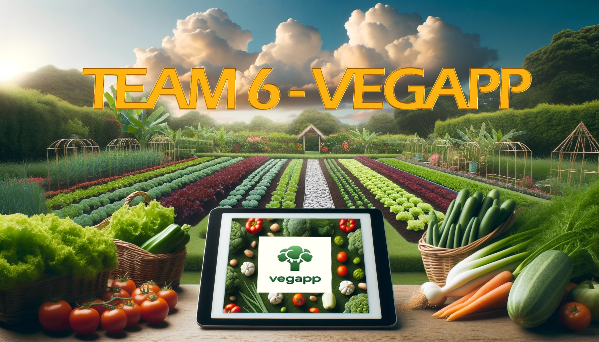

VeGApp encapsulates the full potential of technology to transform traditional gardening into a modern, organized, and rewarding experience. From the heart of your garden to the comfort of your home, VeGApp is your ultimate gardening companion.

## Project Overview

VeGApp was developed as a scalable and fully tested MVP that brings together a Flutter/Dart mobile application, an HTML/CSS/JS web application, a Spring Boot/Java backend, a Swagger-documented API, and a PostgreSQL database. The project also integrates CI/CD, deployment, and version control practices through GitLab, Docker, and OpenShift/Kubernetes. Development was organized with an Agile/Scrum methodology, using Jira and XWiki to coordinate a 6-person team and deliver the application under time constraints.

## Table of Contents

1. [Project Overview](#project-overview)
2. [Repository Structure](#repository-structure)
3. [Results Summary](#results-summary)
4. [Code Architecture: Frontend](#code-architecture-frontend)
5. [Code Architecture: Backend](#code-architecture-backend)
6. [Code Architecture: Website](#code-architecture-website)
7. [Code Architecture: Infrastructure](#code-architecture-infrastructure)
8. [VeGApp's Network Configuration](#vegapps-network-configuration)
9. [GitLab Pipeline Setup](#gitlab-pipeline-setup)
10. [`oc` Commands to Connect to the PostgreSQL Database](#oc-commands-to-connect-to-the-postgresql-database)
11. [Notes About Local Deployment](#notes-about-local-deployment)
12. [Testing](#testing)
13. [Members](#members)
14. [Project Status](#project-status)
15. [License](#license)

## Repository Structure

```text
.
|-- frontend/                 # Flutter/Dart mobile application
|-- vegapp-server/            # Spring Boot backend and hosted website
|-- postgresdb/               # PostgreSQL Dockerfile and initialization script
|-- test-backend/             # Backend testing framework and logs
|-- test-synchronization/     # Synchronization testing framework and logs
|-- kompose-local-adjusted/   # Adjusted Kubernetes/OpenShift deployment files
|-- kompose-local-raw/        # Raw kompose conversion output
|-- images/                   # README and project images
|-- .gitlab-ci.yml            # GitLab CI/CD pipeline configuration
|-- .gitignore                # Git ignore rules
|-- docker-compose-local.yml  # Local Docker Compose configuration
|-- README.md                 # Project documentation
`-- vegapp.pdf                # Project PDF artifact
```

## Results Summary

The final mobile application covers the main garden-management workflow: users can create and select gardens, navigate from a garden home screen, manage the catalogue and categories, inspect vegetables, browse seeds, design plots, track activities in a calendar, and follow synchronization status. The gallery below showcases all app screens extracted from slides 2 through 10 of [vegapp.pdf](vegapp.pdf).

<table>
  <tr>
    <td width="50%">
      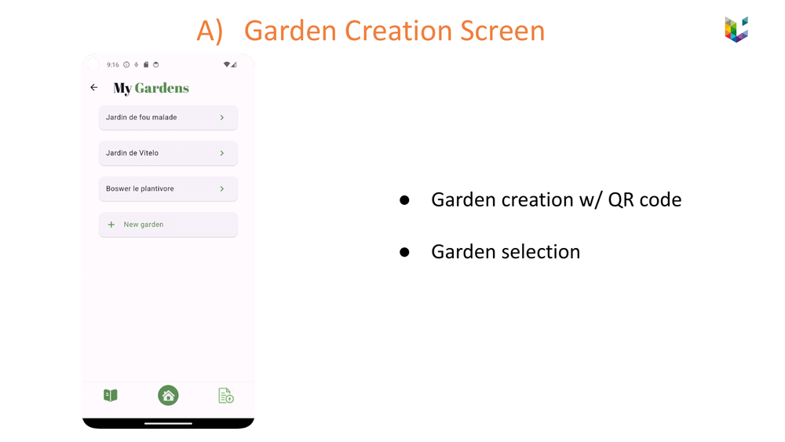
    </td>
    <td width="50%">
      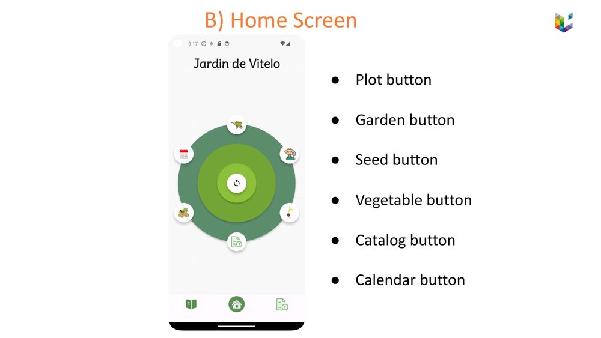
    </td>
  </tr>
  <tr>
    <td width="50%">
      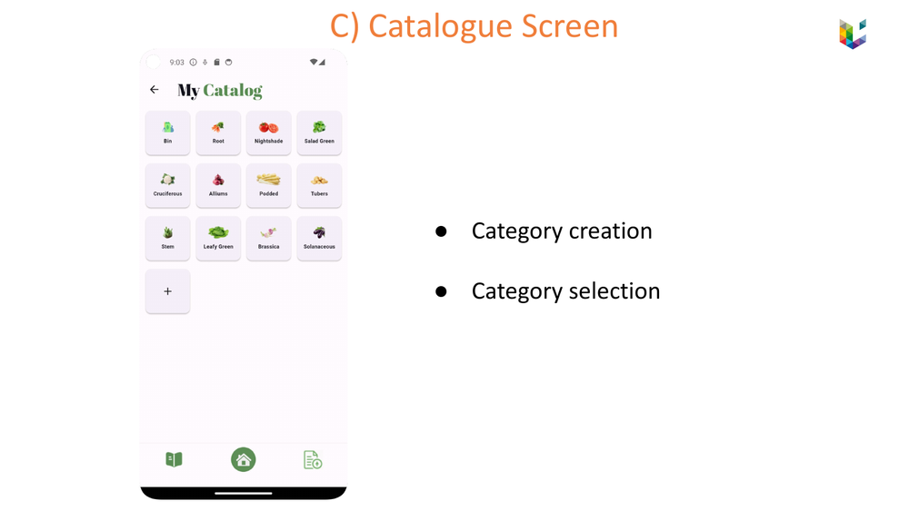
    </td>
    <td width="50%">
      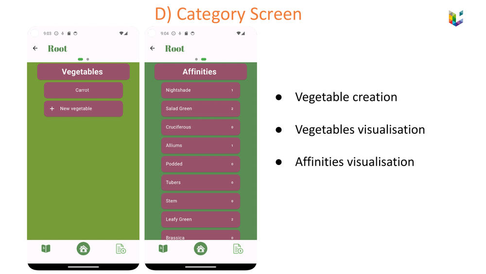
    </td>
  </tr>
  <tr>
    <td width="50%">
      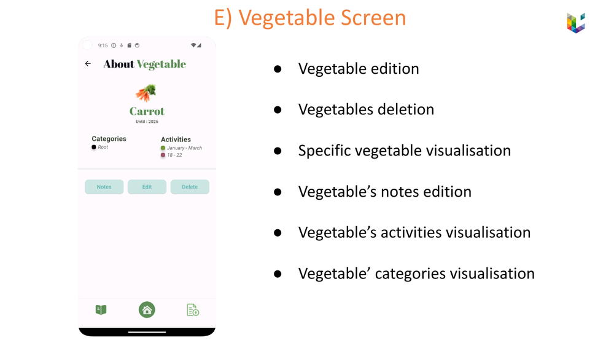
    </td>
    <td width="50%">
      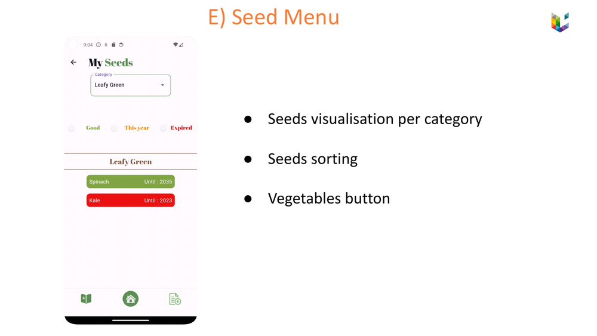
    </td>
  </tr>
  <tr>
    <td width="50%">
      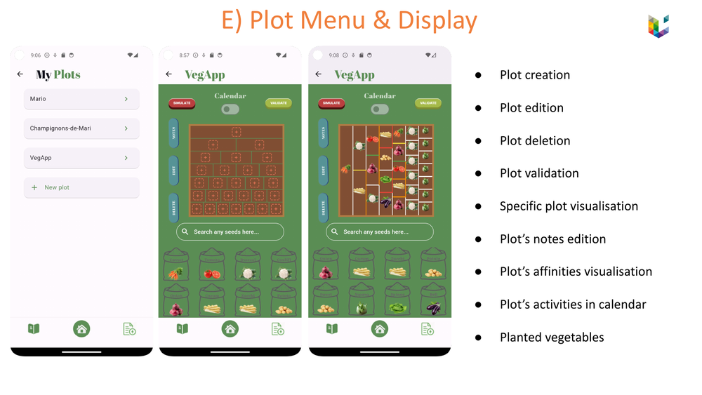
    </td>
    <td width="50%">
      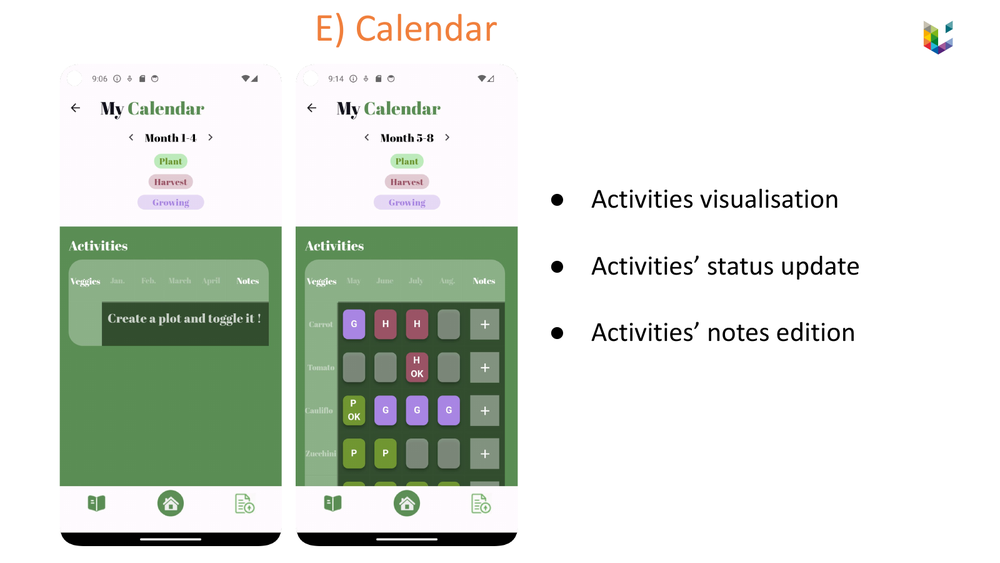
    </td>
  </tr>
  <tr>
    <td colspan="2">
      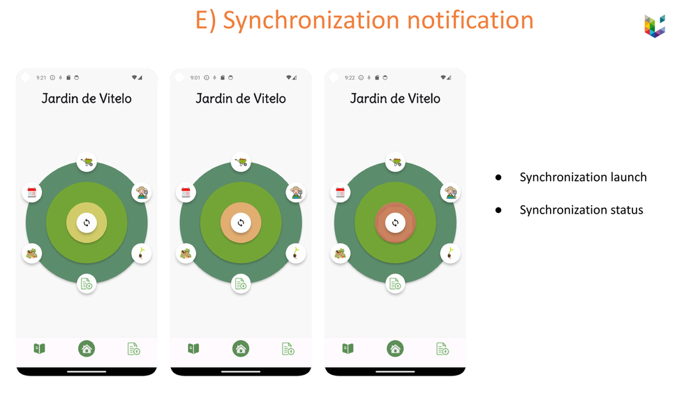
    </td>
  </tr>
</table>

## Code Architecture: Frontend

The mobile frontend architecture is located in `/frontend/lib/`. It follows a Model-View-Controller (MVC) pattern where each application component is categorized as a model, view, or controller.

### MVC Responsibilities

- **Models** manage the application's data, logic, and rules. They represent the application's dynamic data structure independently of the user interface.
- **Views** provide the visual representation of models, presenting data in a specific format dictated by the controller. The separation between view and model means that the user interface can be modified without altering the underlying business logic.
- **Controllers** act as the interface between the model and view components. They handle business logic and incoming requests, manipulate data through the model component, and interact with views to obtain the final result.

### Frontend Components

```text
/frontend/lib/
|-- main.dart
|-- models/                         # Application objects, data, logic, and rules
|   |-- calendar_model.dart
|   |-- category_model.dart
|   |-- garden_model.dart
|   |-- plant_model.dart
|   |-- plot_model.dart
|   |-- selected_garden_model.dart   # Application logic model
|   |-- synchronize_model.dart
|   |-- synchronizing_model.dart     # Application logic model
|   `-- vegetable_model.dart
|-- views/                          # Application screens and shared interface elements
|   |-- calendar_view.dart
|   |-- categories_view.dart
|   |-- custom_app_bar.dart          # Custom app bar
|   |-- custom_bottom_bar.dart       # Custom bottom bar
|   |-- gardens_view.dart
|   |-- home_view.dart
|   |-- new_garden_view.dart
|   |-- new_user_view.dart
|   |-- notes_view.dart
|   |-- plot_creation_view.dart
|   |-- plot_display_view.dart
|   |-- plots_view.dart
|   |-- primary_category_view.dart
|   |-- secondary_category_creation_view.dart
|   |-- secondary_category_view.dart
|   |-- seed_view.dart
|   |-- start_view.dart
|   |-- vegetable_creation_view.dart
|   `-- vegetable_display_view.dart
`-- controllers/                    # User input, screen requests, support utilities, and navigation
    |-- calendar_controller.dart
    |-- category_controller.dart
    |-- database_helper.dart         # Phone database
    |-- garden_controller.dart
    |-- init_controller.dart         # New user/garden initialization
    |-- plot_controller.dart
    |-- qr_code_scanner.dart         # QR codes
    |-- routes.dart                  # App navigation
    |-- synchronize_controller.dart  # Online database synchronization
    |-- token.dart                   # Secure user identification token storage
    `-- vegetable_controller.dart
```

## Code Architecture: Backend

The backend server uses Spring Boot, a Java-based framework designed to make the development of web applications and microservices with the Spring Framework faster and easier. The backend is connected to a PostgreSQL database used to store application data.

### Backend Components

```text
/vegapp-server/
|-- pom.xml                                  # Maven configuration and server dependencies
|-- mvnw                                     # Maven Wrapper for local builds without installing Maven
`-- src/main/java/com/vegAppTest/
    |-- ConnectDbApplication.java            # Spring Boot application entry point
    |-- DataInitializer.java                 # Initial data setup
    |-- Controllers/                         # HTTP endpoints
    |   |-- ArtifactRedirect_C.java
    |   |-- CategoryPrimary_C.java
    |   |-- CategorySecondary_C.java
    |   |-- Garden_C.java
    |   |-- Gardener_C.java
    |   |-- Init_C.java
    |   |-- Plant_C.java
    |   |-- Plot_C.java
    |   |-- Role_C.java
    |   |-- Sync_C.java
    |   `-- Veggie_C.java
    |-- Entities/                            # Database table mapping through Hibernate
    |   |-- CategoryPrimary.java
    |   |-- CategorySecondary.java
    |   |-- Garden.java
    |   |-- Gardener.java
    |   |-- Plant.java
    |   |-- Plot.java
    |   |-- Role.java
    |   |-- Sync.java
    |   `-- Veggie.java
    |-- Repositories/                        # PostgreSQL data access and manipulation
    |   |-- CategoryPrimary_R.java
    |   |-- CategorySecondary_R.java
    |   |-- Garden_R.java
    |   |-- Gardener_R.java
    |   |-- Plant_R.java
    |   |-- Plot_R.java
    |   |-- Role_R.java
    |   |-- Sync_R.java
    |   `-- Veggie_R.java
    |-- Security/                            # Token management, request authentication, and HTTPS support
    |   |-- Authentication_C.java
    |   |-- AuthenticationRequest.java
    |   |-- AuthenticationResponse.java
    |   |-- RegisterRequest.java
    |   |-- Config/
    |   `-- Service/
    |-- Wrapper/                             # Request and response wrapper classes
    `-- documentation                        # API documentation artifact
```

The server is mostly divided into controllers, entities, and repositories. Controllers contain the HTTP endpoints. Entities describe the database tables. Repositories allow data access and manipulation in the PostgreSQL database. Hibernate maps Java objects to database tables through annotations such as `@Entity` and `@Table`, so tables can be created from the annotated entities.

Token management is handled within the files in the `Security` folder. The server checks token validity before allowing a request to be handled by the endpoints. The HTTPS connection is handled with a self-signed certificate.

Maven, an open-source build automation tool, is used to build the server. More specifically, Maven Wrapper is used, which allows the server to be built and run locally without installing Maven. It also ensures that everyone works with the same Maven version. The `pom.xml` file contains the Maven configuration files and all dependencies used by the server.

To run `vegapp-server`, launch the following command inside the `vegapp-server` directory:

```bash
./mvnw spring-boot:run
```

## Code Architecture: Website

The website is hosted by the Spring Boot server and is structured around HTML pages, shared images, and CSS files. The root `index.html` file directs users to `/website/login.html`.

### Website Pages and Assets

```text
/vegapp-server/src/main/resources/static/
|-- index.html                         # Directs users to /website/login.html
|-- website/                           # Website pages
|   |-- accountsettings.html           # View account information and delete the account
|   |-- app_authenticate.html          # Get the QR code for authentication via the mobile app
|   |-- garden_addusers.html           # Select the role for sharing the garden with a user
|   |-- garden_addusers_result.html    # Display the QR code to share the garden with a user
|   |-- garden_delete.html             # Delete a garden
|   |-- garden_history.html            # View the history of a given garden
|   |-- garden_homepage.html           # Access the homepage of a garden
|   |-- garden_permissions.html        # Manage user permissions for a garden
|   |-- garden_rename.html             # Rename a garden
|   |-- login.html                     # Log in to a VeGApp account
|   |-- menu.html                      # Main menu where users can select a garden
|   |-- signup.html                    # Create a new VeGApp account
|   `-- signup_result.html             # Confirm that the account was successfully created
|-- images/                            # Website images
|   |-- background.png                 # Background image for login.html and signup.html
|   |-- logo.png                       # VeGApp logo
|   `-- mygarden.png                   # Image of a garden
`-- css/                               # Website stylesheets
    |-- styles.css                     # Design of login.html, signup.html, and signup_result.html
    |-- styles_accountsettings.css     # Design of accountsettings.html
    |-- styles_app_authenticate.css    # Design of app_authenticate.html
    |-- styles_menu.css                # Design of menu.html
    `-- garden/                        # Garden page stylesheets
        |-- styles_addusers.css        # Design of garden_addusers.html and garden_addusers_result.html
        |-- styles_delete.css          # Design of garden_delete.html
        |-- styles_history.css         # Design of garden_history.html
        |-- styles_homepage.css        # Design of garden_homepage.html
        |-- styles_permissions.css     # Design of garden_permissions.html
        `-- styles_rename.css          # Design of garden_rename.html
```

## Code Architecture: Infrastructure

The infrastructure files define deployment, CI/CD, database initialization, local orchestration, and shared project assets.

```text
.
|-- images/                                  # Images relevant to this project
|-- kompose-local-adjusted/                  # Adjusted deployment files from kompose convert
|-- kompose-local-raw/                       # Raw outputs from kompose convert
|-- postgresdb/                              # PostgreSQL Dockerfile and initialization script
|-- vegapp-server/                           # Spring Boot server
|   |-- src/main/java/com/vegAppTest/        # Spring Boot server files
|   `-- src/main/resources/static/           # Spring Boot server webpage
|-- .gitlab-ci.yml                           # Pipeline configuration file
`-- docker-compose-local.yml                 # Docker Compose file
```

## VeGApp's Network Configuration

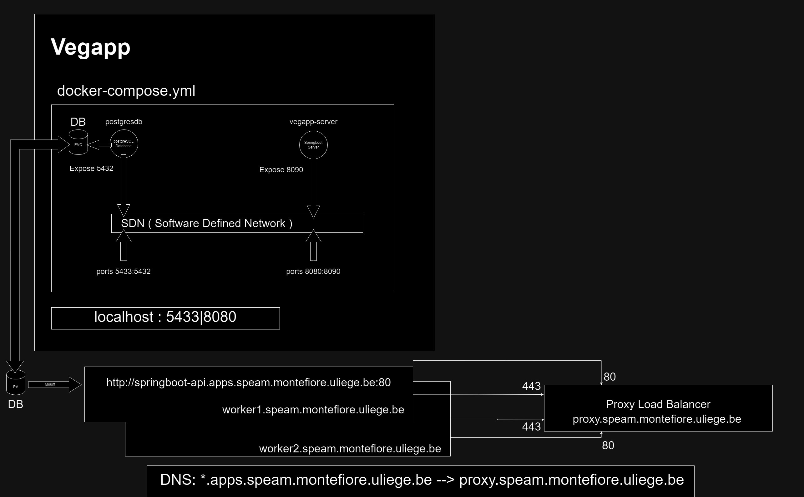

## GitLab Pipeline Setup

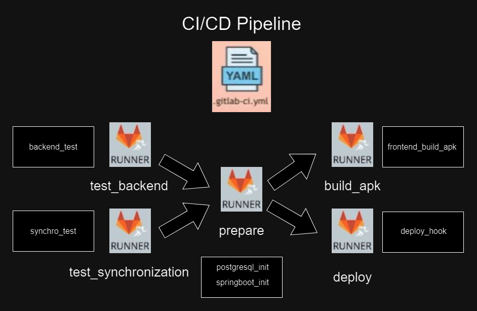

During the prepare stage, GitLab runners with the right permissions (tags) use Docker-in-Docker to log in to the host registry and build images for the PostgreSQL database and the Spring Boot server. Building the images is triggered by changes on respective paths.

The test stage is divided in two: one part concerns the backend, and one part concerns synchronization. The deploy stage involves deploying manually for now.

Variables that are set manually, stored in the GitLab secret store, and passed as environment variables inside the pipeline for security reasons are:

```bash
# User/Pwd used to login, build, push to gitlab image registry
PUSH_USER: $CI_DEPLOY_TOKEN_USER
PUSH_TOKEN: $CI_DEPLOY_TOKEN_PASS
# PosgreSQL database password set as an environment inside the pipeline 
# So that images built using docker-in-docker inherit the variable so that the server can connect to the database.
POSTGRESS_PASSWORD_CICD: $POSTGRESS_PASSWORD_CICD
```

## `oc` Commands to Connect to the PostgreSQL Database

Follow the [`oc`](https://jira.montefiore.ulg.ac.be/xwiki/wiki/team0623/view/Operations/Tutorials/OpenShiftKubernetes/Using%20the%20%27oc%27%20Command%20Line/) command line tool installation.

Go to the [OpenShift GUI](https://console-openshift-console.apps.speam.montefiore.uliege.be/topology/ns/vegapp?view=graph) related to the project `vegapp`, then select **Help** > **Command line tools** > **Copy login command**.

```bash
oc login --token=<your token> --server=<server's URL>
oc get pods
oc port-forward pod/<pod_name> <hostport>:<containerport>
oc port-forward pod/postgresdb-749fd78565-rgqmk <hostport>:5432
```

Recall that the container port is defined as `5432` in VeGApp's network configuration.

## Notes About Local Deployment

- **Local compose file**: `docker-compose-local.yml` can be renamed to `docker-compose.yml` locally.
- **Local build behavior**: Executing the commands below will build the PostgreSQL database and Spring Boot server images locally.
- **Local setup**: Clone the repository, have Docker installed (Docker Desktop is also convenient to use), and open a terminal in `/vegapp/team-6`.

```bash
docker compose up
docker compose down -v
```

- **`docker compose up`**: Starts containers based on the `docker-compose.yml` file.
- **`docker compose down -v`**: Stops containers. The `-v` option removes volumes so that they are no longer persistent locally.
- **Docker Desktop**: Allows you to see the image built from the `docker-compose.yml` file and the running containers.
- **Spring Boot server port**: The server hosts the website on port `8090` of the container, mapped to port `8080` of the host machine.
- **PostgreSQL port**: The PostgreSQL database runs on port `5432` of the container, mapped to port `5433` of the host machine.

## Testing

The goal of this Software Project Engineering and Management project is to specify, develop, and test. The latter is of main interest during this analysis.

The process model for our software development must integrate both model-driven approaches and Agile/Scrum methodologies. The project's alchemy can be defined as the blending of structured, model-driven planning with the flexibility of Agile/Scrum to create a product that meets the identified need and solves the initial problem.

### Development and Testing Approach

- **Problem/Need Identification**: The VeGApp mobile application and a web interface for managing one's garden.
- **Refinement of Models**: The design and development are guided by models.
  - **Requirements**: What the software should do.
  - **Use cases**: Scenarios of how the software will be used.
  - **Domain objects**: The significant entities and their relationships within the problem domain.
  - **Components**: The modular parts of the software that will be built.
- **Product Breakdown/Product Backlog**: Insights from models are used to create a list of features, improvements, and bug fixes known as the product backlog in Agile/Scrum. This involves breaking down the product into smaller, manageable pieces that can be prioritized and scheduled for development in various sprints.
- **Refinement of Product**: The items in the product backlog are refined into a final application, keeping the model-driven approach consistent throughout development. This is where the application is built, tested, and prepared for release.
- **Agile/Scrum**: Iterative development, regular reviews, adaptation to changing requirements, and frequent communication among stakeholders are imperative.

**Thus, testing must be interpreted as an attitude toward our software development throughout the year.**

This implies that our models, which must be improved after Scrum meetings, sprint reviews, and technical problems encountered, are part of the **Testing** attitude just described. Furthermore, problems faced in order to create the application as a whole (mobile and web applications), while reconciling the needs of our client, are also part of the **Testing** attitude.

On one hand, the improvement of our models, understanding, and usage of technologies is defined by how Scrum meetings, client meetings, and sprint reviews were done, thus making this testing relevant for this part.

On the other hand, a more concrete and precise analysis of the technologies is presented in the context of the final product and the technological means implemented to achieve it. This implies that testing can be done regarding how we choose to conceptualize, build, and execute our mobile and web applications.

The mobile application was built using Flutter for the frontend. The backend consists of a local database, also in Flutter for offline features, and online features using a Spring Boot server and a PostgreSQL database deployed in OpenShift. All of this is in the context of continuous development/continuous integration with the help of the GitLab environment and OpenShift features. In addition, the Spring Boot server takes care of the web application and implements the web interface.

### Testing the Frontend

- This is achieved by using the GitLab pipeline to ensure checks are run before building the APK of our application.
- Website tests can directly be implemented inside the server.

### Testing the Backend

- This is more complex as it concerns multiple aspects of our software development. The API can be tested regarding the offline database and the online database to ensure, for example, that a connection cut does not break the application and that requests are indeed performed as they should be and retrieve what is expected. This is done through a Python script that simulates requests.
- Another test we are working on will ensure that the protocol we use as a synchronization mechanism with a connection loss does not break the application or lead to a failure case. Synchronization is tested in particular cases using the framework defined in the test directory of the project.

## Members

| Name | Master |
|------|--------|
| Alexandre Bruno | Computer Science focus on Computer Security |
| Arnaud Crucifix | Computer Science focus on Computer Security |
| Louis Hogge | Computer Science & Engineering focus on Management |
| Simon Louveau | Computer Science & Engineering focus on Computer Security |
| Julie Ngamia Djabiri | Computer Science & Engineering focus on Computer Security |
| Gregory Voskertchian | Computer Science & Engineering focus on Computer Security |

## Project Status

The project is finished.

## License

Project realised in the context of the Software project engineering and management PROJ0010-1 course at Université of Liège.
