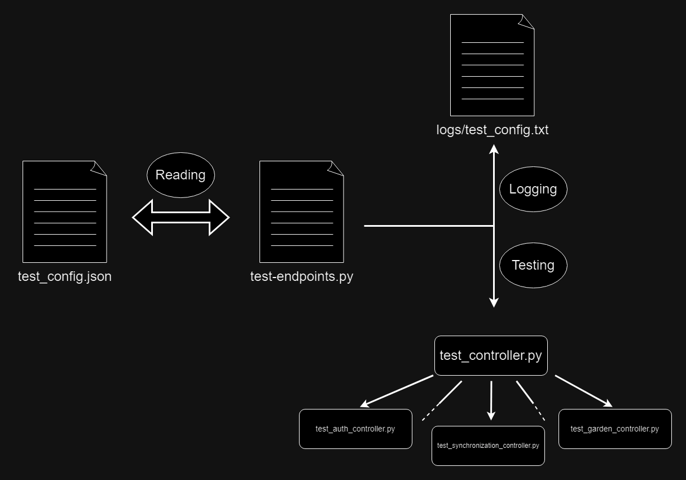

# Team 6 - VeGApp : My Autonomous Vegetable Garden App

# Table of Contents
1. [Testing Framework](#1-testing-framework)
2. [Adding Tests](#2-adding-tests)

## 1. Testing Framework



- $1.1$ $test\_ config.json$
    * A Json file that contains the description of the test and the function that will be used inside the controller being tested. It's practical for lightening the $test-endpoints.py$ file and iterating over all tests regarding all controllers in a single run.
- $1.2$ $test-endpoints.py$
    * The main python file that instantiates the controllers instances and runs the tests while logging outputs inside the $logs/test\_ config.txt$ file
- $1.3$ $logs/test\_ config.txt$ file
    * The file containing all the logs of the tests performed. This is used for debugging, etc.
- $1.4$ $test\_ controller.py$
    * The main file from which each controller file will inherit the main methods and the logic.
- $1.5$ $test\_ auth\_ controller$, etc.
    * These are the controller files in which the test functions are defined.

## 2. Adding Tests
- $2.1$ Three steps in order to add tests :
    * Change the $test\_ config.json$ file to add the endpoint tested, the name of the test and the method defining the test
    * Change the $test-endpoints.py$ file to add the logs and instantiate the controller named XXX (as an example)
    * Create the $test\_ XXX\_ controller.py$ file to define the methods used for testing.

- $2.2$ Inside the controller python file, the test function is mainly defined (if no data needed to perform the request on the endpoint) as example :
    ```python
    def test1(self):
        return self.call_endpoint1('post', '/garden', {"name":"Jardin testing"}, 200)
    ```
    
- $2.3$ Inside $test\_ controller.py$ :
    ```python
    def call_endpoint1(self, method, endpoint, data, expected_status_code):
        return {'Url': url, 'Status Code': status_code, 'Success': True, 'Response of Server': response_server}
    ```